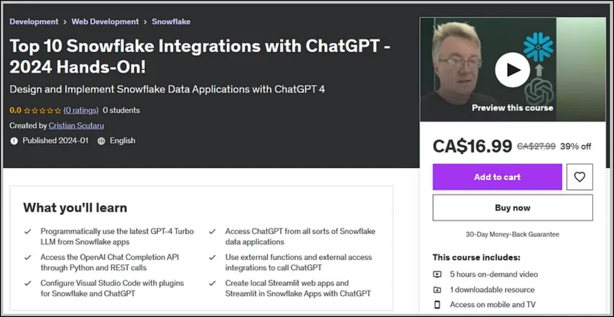

# Top 10 Snowflake Integrations with ChatGPT

Experiments for my Udemy course [**Top 10 Snowflake Integrations with ChatGPT - 2024 Hands-On!**](https://www.udemy.com/course/snowflake-with-chatgpt/?couponCode=LOWEST-PRICE) - get it here for **the LOWEST-PRICE**! Refer to individual sections for local documentation.

[](https://www.udemy.com/course/snowflake-with-chatgpt/?couponCode=LOWEST-PRICE)

## My Promo Video

[](https://youtu.be/rbDJ30O8198)

## App #1: Configure ChatGPT as a Coding Assistant for Snowflake in VSCode

* Create a free trial Snowflake account. First look at the Snowsight web UI.
* Create a free trial OpenAI API account (or provision existing one). Explore alternatives with ChatGPT and Big Chat/Copilot playgrounds, DALL-E (GPT-4 Vision) and Whisperer APIs.
* Install the free Visual Studio Code IDE and configure a Python venv (see below).
* Install the Snowflake plugin in VSCode and connect with basic authN. Execute SQL scripts and queries from VSCode.
* Install the ChatGPT Genie AI plugin in VSCode and connect with the OpenAI API key. Explore basic prompts.

Setup instructions for this GitHub repository:

1) Install *Python*.
2) Create and switch to a *virtual environment*:

```
python -m venv venv
venv/scripts/activate
```
3) Upgrade *pip*:

```
pip install --upgrade pip
```

4) Install dependencies for the whole repository, from *requirements.txt*:

```
pip install -r requirements.txt
```

* **test-code.py** - just for experiments with plugins, to look at.

## App #2: Generate Snowflake Sample Databases with ChatGPT from VSCode

* Generate sample DDL scripts, with normal or star schemas.
* Generate realistic synthetic data.
* Generate Python code for web scraping.
* Generate SQL queries for specific tables. Analyze and optimize queries.

* **1-create-script.sql** - OrderEntry sample database and tables generated by ChatGPT
* **2-generate-customers.py** - Python code using Faker() generated by ChatGPT
* **3-insert-customers.sql** - long INSERT statement produced by executing the previous file
* **4-insert-products.sql** - SQL INSERT statement generated by ChatGPT, using synthetic builtin functions from Snowflake
* **5-web-scrapping.py** - Python code generated by ChatGPT to scrap a web page 
* **6-web-scrapping.csv** - generated by executing the previous file
* **7-select-queries.sql** - 3 SQL data analytics queries generated by ChatGPT

## App #3: Snowflake Metadata Inspector in Natural Language

* **app1.py** - simple Q&A interface with ChatGPT, for metadata info.
* **app2.py** - metadata query generator, running the queries in Snowflake and getting results.
* **app3.py** - evolved UI with tab control.
* **app4.py** - evolved UI with chat controls and session state.

## App #4: Interactive Data Analysis with ChatGPT Bot Agent

* **setup.sql** - SQL queries, to run first after getting the financial__economic_essentials.cybersyn dataset from the Marketplace.
* **app1.py** - select from predefined questions about Snowflake tables/views.
* **app2.py** - basic ChatGPT bot, as chat.
* **app3.py** - data analysis inspector, as chat.
* **deps.py** - utilities for other main files, uploading files from *data/*.
* **data/questions.txt** - hard-coded questions to be asked from a list.
* **data/system-prompt.txt** - table description, to be sent as a system prompt to ChatGPT.

## App #5: Instant Charts with the Advanced Data Analysis Plugin

Most tests will be online, in the ChatGPT playground, with the ChatGPT Plus paid plan. We'll explore uploading a full CSV file and generating instant graphs and info with the Advanced Data Analysis plugin.

* **data/Popular_Baby_Names.csv** - free public dataset for EDA.
* **data/Iris.csv** - data science popular dataset, for cluster analysis
* **data/Bank branch openings and closures.csv** - from the public financial__economic_essentials.cybersyn Marketplace dataset.
* **setup.sql** - to generate the previous downloaded file from Snowflake.

## App #6: Generate a Usage Monitoring Dashboard for Snowflake Account

* **app.py** - very simple Streamlit web app, to run Snowflake queries on metadata and display Plotly charts.
* **sql/query1.sql** - sample queries.
* **charts/chart1.py** - sample charts, from the previous query results.

## App #7: Data Enrichment with an External Integration of ChatGPT

* **setup.sql** - creating an External Access Integration for OpenAI.
* **app.py** - deployed Streamlit App w/ simple ChatGPT Q&A interface, in chat mode.

## App #8: ChatGPT with LlamaIndex on Personal Documents

* **app.py** - ChatGPT agent for custom content - create index and query.
* **spool/Streamlit-for-Snowflake.pdf** - input file to parse. 
* **spool-empty/empty.pdf** - input empty file to parse. 
* **kb/** - output directory, where the LlamaIndex will be generated.

## App #9: ChatGPT SQL Generator with LangChain

* **app.ipynb** - Jupyter Notebook to run from within VSCode.
* **app1.py** - implementation as a local Streamlit web app.
* **app2.py** - implementation as a web app to deploy in the Streamlit Community Cloud.

To deploy as a local web app, in the same subfolder you must create a *.streamlit* subfolder with a **secrets.toml** file with the following content (replace all sensitive data with yours):

```
# .streamlit/secrets.toml

OPENAI_API_KEY = "sk-Z5I10I...kFJ8kftKnnEPTKLvK"

[connections_snowflake]
account = "<your_snowflake_account>"
user = "<your_user_name>"
password = "<your password>"
database = "SNOWFLAKE_SAMPLE_DATA"
schema = "TPCH_SF1"
warehouse = "COMPUTE_WH"
role = "ACCOUNTADMIN"
```
Make sure the section says **[connections_snowflake]** (with an underscore _ separator), not **[connections.snowflake]**.

The full procedure is [described in detail here](./secrets-toml.md).

## App #10: Snowflake Query Analyzer and Optimizer

* **app1.py** - implementation as a local Streamlit web app.
* **app2.py** - implementation as a Streamlit App.
* **setup.sql** - complex query to analyze.
