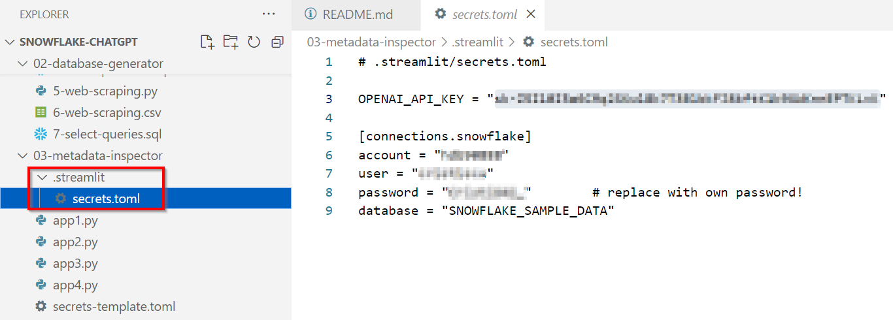
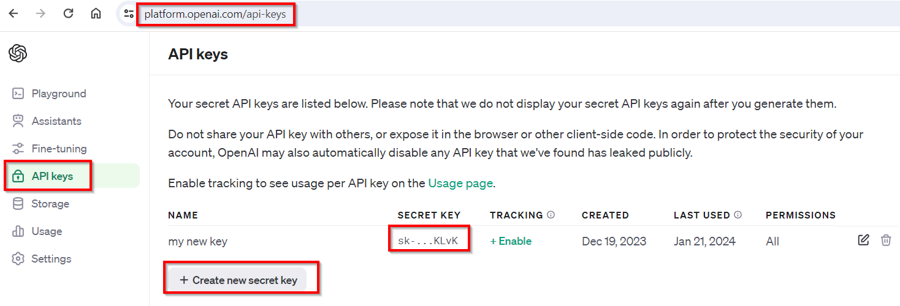
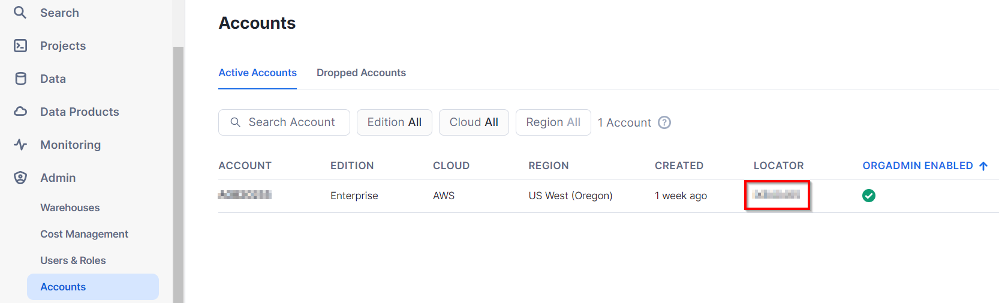

# How to create a .streamlit/secrets.toml file

For some local Streamlit web apps developed here, you need to create a **secrets.toml** file with both ChatGPT and Snowflake credentials. This is what I see in my VSCode. Remark the .streamlit/secrets.toml - this is missing from GitHub, as it should - with its content on screen:

For the ChatGPT API key, you must login first (for free) to https://platform.openai.com/, then you go to Settings - API keys (or pass the URL you see here). Click on *"Create new secret key"* and save the key in our secrets.toml file. As you'll no longer see the value in clear again in this screen, you can only generate a new one:

For the Snowflake account, you may copy the LOCATOR value and pass it in the "account" property, in secrets.toml. The "user" and "password" are the ones you connect with to your Snowflake's web UI, the same that you used first time, when you created the account:

